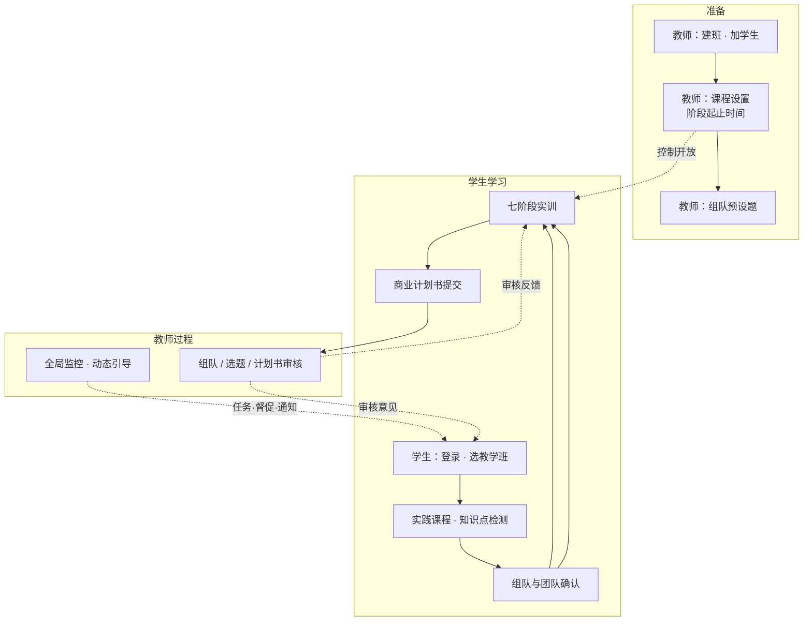
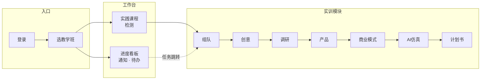
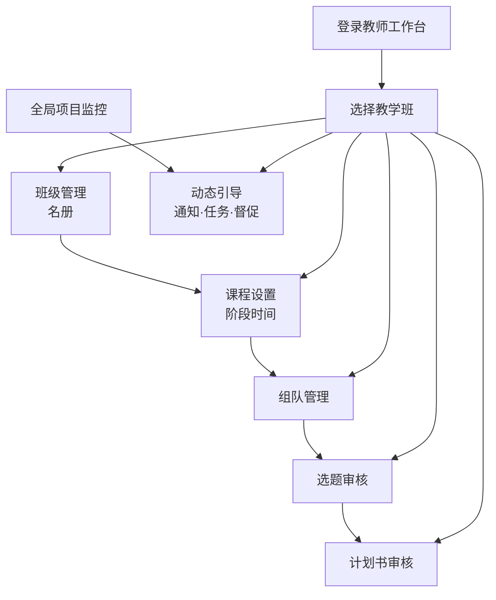
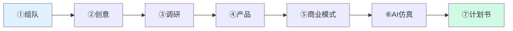
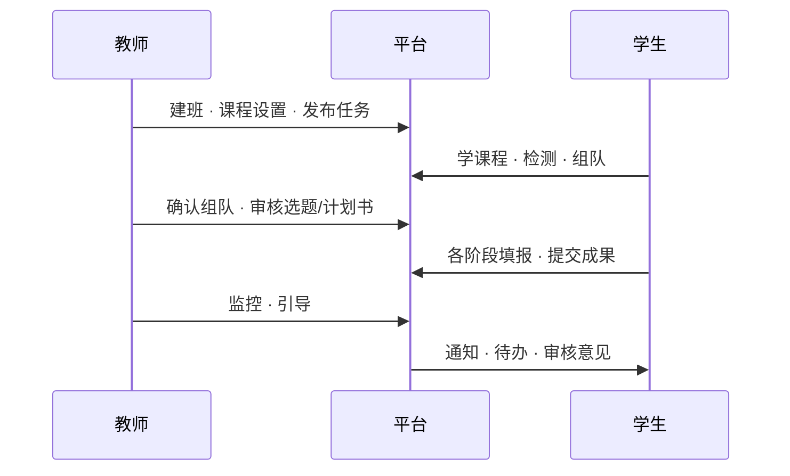

# 大学生创业实训平台 · 操作流程导图

> 教师 / 学生端（不含管理后台）。在支持 Mermaid 的编辑器或 [mermaid.live](https://mermaid.live) 中打开本文件预览后截图。

## 1. 教学总流程

```mermaid
flowchart TB
    subgraph 准备
        A[教师：建班 · 加学生]
        B[教师：课程设置<br/>阶段起止时间]
        C[教师：组队预设题]
    end

    subgraph 学生学习
        D[学生：登录 · 选教学班]
        E[实践课程 · 知识点检测]
        F[组队与团队确认]
        G[七阶段实训]
        H[商业计划书提交]
    end

    subgraph 教师过程
        I[全局监控 · 动态引导]
        J[组队 / 选题 / 计划书审核]
    end

    A --> B --> C
    D --> E --> F --> G --> H
    B -.控制开放.-> G
    F --> G
    I -.任务·督促·通知.-> D
    J -.审核反馈.-> G
    H --> J
    J -.审核意见.-> D
```

## 2. 学生端操作路径

```mermaid
flowchart LR
    subgraph 入口
        S0[登录]
        S1[选教学班]
    end

    subgraph 工作台
        S2[进度看板<br/>通知 · 待办]
        S3[实践课程<br/>检测]
    end

    subgraph 实训模块
        M1[组队]
        M2[创意]
        M3[调研]
        M4[产品]
        M5[商业模式]
        M6[AI仿真]
        M7[计划书]
    end

    S0 --> S1 --> S2
    S1 --> S3
    S3 --> M1 --> M2 --> M3 --> M4 --> M5 --> M6 --> M7
    S2 -.任务跳转.-> M1
```

## 3. 教师端操作路径

```mermaid
flowchart TB
    T0[登录教师工作台]
    T1[选择教学班]

    T0 --> T1

    T1 --> CM[班级管理<br/>名册]
    T1 --> CS[课程设置<br/>阶段时间]
    T1 --> TR[组队管理]
    T1 --> GV[动态引导<br/>通知·任务·督促]
    T1 --> RV[选题审核]
    T1 --> BP[计划书审核]

    MON[全局项目监控] --> GV

    CM --> CS
    CS --> TR
    TR --> RV
    RV --> BP
```

## 4. 实训七阶段（学生）

```mermaid
flowchart LR
    direction LR
    A1[①组队] --> A2[②创意]
    A2 --> A3[③调研]
    A3 --> A4[④产品]
    A4 --> A5[⑤商业模式]
    A5 --> A6[⑥AI仿真]
    A6 --> A7[⑦计划书]

    style A1 fill:#e0f2fe
    style A7 fill:#d1fae5
```

## 5. 教师与学生协同（简图）

```mermaid
sequenceDiagram
    participant 教师
    participant 平台
    participant 学生

    教师->>平台: 建班 · 课程设置 · 发布任务
    学生->>平台: 学课程 · 检测 · 组队
    教师->>平台: 确认组队 · 审核选题/计划书
    学生->>平台: 各阶段填报 · 提交成果
    教师->>平台: 监控 · 引导
    平台->>学生: 通知 · 待办 · 审核意见
```
